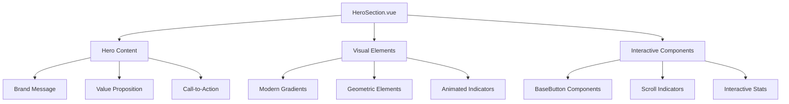
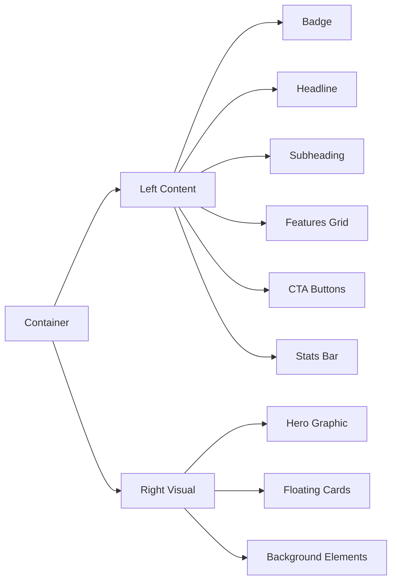

# Hero Section Redesign: Modern Startup Style

## Overview

This design document outlines the redesign of the HeroSection.vue component to create a more modern, startup-like aesthetic while maintaining professional credibility. The current implementation shows conflicting messaging (10 years vs 1 year experience) and needs a cohesive, contemporary approach that resonates with modern engineering companies.

### Current State Analysis
- Two conflicting experience claims (10 years in current hero section)
- Traditional, somewhat conservative design approach
- Focus on established credibility rather than innovation
- Limited visual hierarchy and modern design elements

### Design Goals
- Create a modern, startup-inspired aesthetic
- Maintain professional engineering credibility
- Resolve messaging inconsistencies
- Implement contemporary UI patterns
- Enhance visual impact and user engagement

## Architecture

### Component Structure
The redesigned HeroSection.vue will maintain the existing Vue 3 component architecture while implementing modern design patterns:



### Modern Design Elements

#### 1. Visual Hierarchy
- **Hero Badge**: Startup-style announcement badge with animated elements
- **Typography Scale**: Larger, bolder headlines with modern font weights
- **Content Layering**: Clear visual separation between sections
- **Micro-interactions**: Subtle animations for engagement

#### 2. Startup Aesthetics
- **Gradient Backgrounds**: Modern gradient combinations
- **Glass Morphism**: Subtle transparency effects
- **Geometric Shapes**: Abstract geometric elements
- **Bold Typography**: Contemporary font treatments
- **Minimal Color Palette**: Clean, modern color scheme

## Component Design Specifications

### Layout Structure



### Content Strategy

#### Brand Messaging
**New Positioning**: "Next-Generation Engineering Solutions"
- Emphasize innovation and modern approaches
- Focus on cutting-edge technology integration
- Highlight agility and startup mentality

#### Experience Narrative
**Unified Message**: "Founded by experienced engineers with startup agility"
- Remove conflicting experience claims
- Focus on team expertise rather than company age
- Emphasize fresh approach to traditional engineering

#### Value Propositions
1. **Innovation-First**: Modern engineering solutions
2. **Agile Delivery**: Fast, efficient project execution
3. **Tech-Enabled**: Digital tools and modern processes
4. **Client-Centric**: Startup-level customer service

### Visual Design System

#### Color Palette Modernization
```css
/* Primary Gradient */
background: linear-gradient(135deg, #667eea 0%, #764ba2 100%)

/* Accent Colors */
--accent-cyan: #06b6d4
--accent-emerald: #10b981
--accent-violet: #8b5cf6

/* Neutral Modernization */
--gray-50: #f8fafc
--gray-900: #0f172a
```

#### Typography Scale
- **Headline**: 3.5rem (56px) - Bold, modern sans-serif
- **Subheading**: 1.25rem (20px) - Medium weight
- **Body**: 1rem (16px) - Regular weight
- **Captions**: 0.875rem (14px) - Medium weight

#### Component Variants

##### Hero Badge
- Pill-shaped container with gradient border
- Animated pulse indicator
- Modern typography treatment
- Subtle shadow and glow effects

##### Call-to-Action Buttons
- **Primary**: Gradient background with hover effects
- **Secondary**: Glass morphism style with border
- **Micro-interactions**: Hover animations and state changes

##### Stats Display
- Modern card-based layout
- Animated counters
- Icon integration
- Responsive grid system

### Interactive Elements

#### Scroll Indicators
- Modern scroll-down animation
- Gradient stroke animation
- Smooth scrolling behavior
- Responsive positioning

#### Floating Elements
- **Achievement Cards**: Modern certification displays
- **Process Indicators**: Animated workflow elements
- **Social Proof**: Client testimonial snippets

### Responsive Design Strategy

#### Breakpoint Behavior
- **Mobile (320px-768px)**: Stacked layout, simplified animations
- **Tablet (768px-1024px)**: Adjusted proportions, maintained interactions
- **Desktop (1024px+)**: Full feature set, enhanced animations

#### Performance Considerations
- Optimized animations for 60fps
- Lazy-loaded visual elements
- Progressive enhancement approach
- Reduced motion support for accessibility

## Technical Implementation Details

### Component Props Interface
```typescript
interface HeroSectionProps {
  variant?: 'startup' | 'professional' | 'hybrid'
  animationLevel?: 'minimal' | 'standard' | 'enhanced'
  showStats?: boolean
  customGradient?: string
}
```

### State Management
```javascript
data() {
  return {
    isVisible: false,
    animationComplete: false,
    statsVisible: false,
    modernFeatures: [
      'AI-Assisted Design',
      'Digital Collaboration',
      'Real-time Monitoring',
      'Sustainable Solutions'
    ],
    startupStats: [
      { value: '50+', label: 'Projects Delivered', icon: '🚀' },
      { value: '98%', label: 'Client Satisfaction', icon: '⭐' },
      { value: '24/7', label: 'Support Available', icon: '💬' }
    ]
  }
}
```

### Animation Integration
- **Intersection Observer**: Trigger animations on scroll
- **CSS Transforms**: Hardware-accelerated animations
- **Staggered Animations**: Sequential element reveals
- **Micro-interactions**: Button and hover effects

### Accessibility Enhancements
- **ARIA Labels**: Comprehensive screen reader support
- **Keyboard Navigation**: Full keyboard accessibility
- **Reduced Motion**: Respect user preferences
- **Color Contrast**: WCAG 2.1 AA compliance

## Modern UI Patterns

### Glass Morphism Implementation
```css
.glass-card {
  background: rgba(255, 255, 255, 0.1);
  backdrop-filter: blur(10px);
  border: 1px solid rgba(255, 255, 255, 0.2);
  border-radius: 16px;
  box-shadow: 0 8px 32px rgba(0, 0, 0, 0.1);
}
```

### Gradient Overlays
```css
.hero-gradient {
  background: linear-gradient(
    135deg,
    rgba(102, 126, 234, 0.9) 0%,
    rgba(118, 75, 162, 0.8) 50%,
    rgba(6, 182, 212, 0.7) 100%
  );
}
```

### Geometric Elements
- **Abstract Shapes**: SVG-based decorative elements
- **Grid Patterns**: Subtle background textures
- **Flowing Lines**: Dynamic path animations
- **Particle Effects**: Lightweight animated backgrounds

## Content Strategy Modernization

### Headline Options
1. **"Engineering the Future, Today"**
2. **"Where Innovation Meets Infrastructure"**
3. **"Next-Gen Engineering Solutions"**

### Value Proposition Statements
- "Combining engineering excellence with startup agility"
- "Digital-first approach to traditional challenges"
- "Fast, innovative, reliable engineering solutions"

### Feature Highlights
1. **Digital Collaboration**: Modern project management tools
2. **Rapid Prototyping**: Quick iteration and validation
3. **Sustainable Design**: Environmentally conscious solutions
4. **24/7 Support**: Always-available client service

## Testing Strategy

### Visual Regression Testing
- Cross-browser compatibility testing
- Responsive design validation
- Animation performance testing
- Accessibility compliance verification

### User Experience Testing
- A/B testing for conversion optimization
- User flow analysis
- Heat mapping for engagement tracking
- Performance metrics monitoring

### Performance Metrics
- **Core Web Vitals**: LCP, FID, CLS optimization
- **Animation Performance**: 60fps maintenance
- **Bundle Size**: Minimized JavaScript payload
- **Image Optimization**: WebP format with fallbacks

## Integration Considerations

### Existing Component Compatibility
- Maintain BaseButton.vue integration
- Preserve scroll functionality
- Ensure routing compatibility
- Maintain Pinia store connections

### Tailwind CSS Extensions
```javascript
// tailwind.config.js additions
theme: {
  extend: {
    animation: {
      'float': 'float 6s ease-in-out infinite',
      'glow': 'glow 2s ease-in-out infinite alternate'
    },
    backdropBlur: {
      xs: '2px'
    }
  }
}
```

### Custom CSS Variables
```css
:root {
  --hero-gradient: linear-gradient(135deg, #667eea 0%, #764ba2 100%);
  --glass-bg: rgba(255, 255, 255, 0.1);
  --modern-shadow: 0 20px 40px rgba(0, 0, 0, 0.1);
}
```