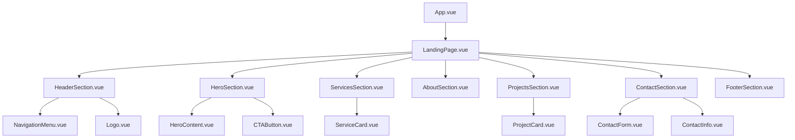

# Landing Page de Engenharia Civil - Documento de Design

## Visão Geral

Esta documentação define o design e arquitetura para uma landing page moderna e profissional de engenharia civil em português, desenvolvida com Vue.js 3, JavaScript e Tailwind CSS v3. O projeto visa criar uma presença digital elegante e funcional para serviços de engenharia civil.

### Objetivos do Projeto
- Criar uma landing page responsiva e moderna
- Apresentar serviços de engenharia civil de forma profissional
- Implementar design clean e acessível
- Otimizar para conversão de leads
- Garantir performance e SEO

## Pilha Tecnológica & Dependências

### Frontend Framework
- **Vue.js 3** - Framework reativo para interface de usuário
- **JavaScript ES6+** - Linguagem de programação principal
- **Tailwind CSS v3** - Framework de CSS utility-first

### Ferramentas de Desenvolvimento
- **Vite** - Build tool e servidor de desenvolvimento
- **Vue Router** - Roteamento (se necessário para múltiplas páginas)
- **Pinia** - Gerenciamento de estado (se necessário)

### Dependências Principais
```json
{
  "vue": "^3.3.0",
  "vue-router": "^4.2.0",
  "tailwindcss": "^3.3.0",
  "autoprefixer": "^10.4.0",
  "postcss": "^8.4.0"
}
```

## Arquitetura de Componentes

### Hierarquia de Componentes



### Definição de Componentes

#### 1. HeaderSection.vue
**Propósito**: Navegação principal e branding
**Props**: 
- `isFixed`: Boolean para fixar header no scroll
- `logoUrl`: String para URL do logo

**Estado**:
- `isMobileMenuOpen`: Boolean para controle do menu mobile

#### 2. HeroSection.vue
**Propósito**: Seção principal de apresentação
**Props**:
- `title`: String do título principal
- `subtitle`: String do subtítulo
- `backgroundImage`: String da URL da imagem de fundo

#### 3. ServicesSection.vue
**Propósito**: Apresentação dos serviços oferecidos
**Props**:
- `services`: Array de objetos com serviços

**Estrutura de Service**:
```javascript
{
  id: String,
  title: String,
  description: String,
  icon: String,
  features: Array<String>
}
```

#### 4. ProjectsSection.vue
**Propósito**: Galeria de projetos realizados
**Props**:
- `projects`: Array de objetos com projetos

**Estrutura de Project**:
```javascript
{
  id: String,
  title: String,
  description: String,
  image: String,
  category: String,
  location: String
}
```

#### 5. ContactSection.vue
**Propósito**: Formulário de contato e informações
**Estado**:
- `formData`: Object com dados do formulário
- `isSubmitting`: Boolean para estado de envio
- `submitted`: Boolean para confirmação

## Estratégia de Estilização

### Paleta de Cores Profissional

```css
/* Cores Primárias */
--primary-wine: #7B1E26;     /* Vinho escuro/marrom-avermelhado para títulos e botões */
--primary-red: #C62828;      /* Vermelho intenso para destaques e nome da empresa */
--primary-white: #FFFFFF;    /* Branco puro para fundo principal */

/* Cores Secundárias */
--secondary-gray-light: #F5F5F5;  /* Cinza muito claro para áreas de separação */
--secondary-gray-dark: #333333;   /* Cinza grafite para texto principal */

/* Cores de Apoio */
--accent-green: #059669;     /* Verde para sucesso */
--accent-warning: #f59e0b;   /* Amarelo para avisos */

/* Neutros Complementares */
--white: #FFFFFF;
--black: #000000;
--gray-50: #FAFAFA;
--gray-100: #F5F5F5;
--gray-200: #EEEEEE;
--gray-300: #E0E0E0;
--gray-400: #BDBDBD;
--gray-500: #9E9E9E;
--gray-600: #757575;
--gray-700: #616161;
--gray-800: #424242;
--gray-900: #333333;
```

### Configuração Tailwind CSS

```javascript
// tailwind.config.js
module.exports = {
  content: ['./src/**/*.{vue,js,ts}'],
  theme: {
    extend: {
      colors: {
        primary: {
          50: '#fdf2f3',
          100: '#fce4e6',
          200: '#f9c8cd',
          300: '#f59ea7',
          400: '#ef6674',
          500: '#C62828',  // Vermelho intenso
          600: '#b91c1c',
          700: '#991b1b',
          800: '#7f1d1d',
          900: '#7B1E26'   // Vinho escuro
        },
        wine: {
          50: '#fdf2f3',
          100: '#fce7e8',
          200: '#f9d4d6',
          300: '#f4b5b9',
          400: '#ec8b92',
          500: '#e15d67',
          600: '#cc4551',
          700: '#a83640',
          800: '#8d2f37',
          900: '#7B1E26'   // Vinho escuro principal
        },
        gray: {
          50: '#FAFAFA',
          100: '#F5F5F5',  // Cinza muito claro
          200: '#EEEEEE',
          300: '#E0E0E0',
          400: '#BDBDBD',
          500: '#9E9E9E',
          600: '#757575',
          700: '#616161',
          800: '#424242',
          900: '#333333'   // Cinza grafite
        },
        accent: {
          green: '#059669',
          warning: '#f59e0b'
        }
      },
      fontFamily: {
        sans: ['Inter', 'system-ui', 'sans-serif'],
        heading: ['Poppins', 'system-ui', 'sans-serif']
      },
      spacing: {
        '18': '4.5rem',
        '88': '22rem',
        '128': '32rem'
      }
    }
  }
}
```

### Sistema de Tipografia

```css
/* Headings */
.heading-xl { @apply text-5xl font-bold font-heading text-wine-900; }
.heading-lg { @apply text-4xl font-bold font-heading text-wine-900; }
.heading-md { @apply text-3xl font-semibold font-heading text-wine-900; }
.heading-sm { @apply text-2xl font-semibold font-heading text-wine-900; }

/* Body Text */
.body-lg { @apply text-lg font-normal text-gray-900; }
.body-md { @apply text-base font-normal text-gray-900; }
.body-sm { @apply text-sm font-normal text-gray-700; }

/* Company Name */
.company-name { @apply text-primary-500 font-bold; }

/* Utilities */
.text-gradient { @apply bg-gradient-to-r from-primary-500 to-wine-900 bg-clip-text text-transparent; }
.btn-primary { @apply bg-wine-900 hover:bg-wine-800 text-white font-semibold py-2 px-4 rounded; }
.btn-secondary { @apply bg-primary-500 hover:bg-primary-600 text-white font-semibold py-2 px-4 rounded; }
```

## Estrutura de Conteúdo

### Seções da Landing Page

#### 1. Header/Navegação
- Logo da empresa
- Menu de navegação (Início, Serviços, Sobre, Projetos, Contato)
- Botão CTA "Orçamento Grátis"
- Navegação responsiva para mobile

#### 2. Hero Section
**Conteúdo**:
- Título: "Engenharia Civil de Excelência"
- Subtítulo: "Projetos estruturais, consultoria técnica e soluções completas para sua obra"
- Texto descritivo sobre experiência e qualidade
- Botões CTA: "Solicitar Orçamento" e "Ver Projetos"
- Imagem de fundo: Obra ou projeto arquitetônico

#### 3. Serviços
**Lista de Serviços**:
```javascript
const services = [
  {
    title: "Projeto Estrutural",
    description: "Cálculo e dimensionamento de estruturas em concreto armado, aço e madeira",
    icon: "building-icon",
    features: ["Fundações", "Pilares e Vigas", "Lajes", "Escadas"]
  },
  {
    title: "Consultoria Técnica",
    description: "Assessoria especializada para obras e projetos de engenharia",
    icon: "consultation-icon",
    features: ["Análise de Projetos", "Laudos Técnicos", "Perícias", "Vistorias"]
  },
  {
    title: "Gerenciamento de Obras",
    description: "Acompanhamento completo desde o planejamento até a entrega",
    icon: "management-icon",
    features: ["Cronograma", "Orçamento", "Fiscalização", "Controle de Qualidade"]
  },
  {
    title: "Regularização",
    description: "Documentação e aprovação de projetos junto aos órgãos competentes",
    icon: "document-icon",
    features: ["Alvará de Construção", "Habite-se", "AVCB", "Documentação Municipal"]
  }
]
```

#### 4. Sobre a Empresa
- História e experiência
- Missão, visão e valores
- Certificações e qualificações
- Equipe técnica

#### 5. Portfólio de Projetos
**Categorias**:
- Residencial
- Comercial
- Industrial
- Infraestrutura

#### 6. Contato
- Formulário de contato
- Informações de localização
- Telefone e email
- Mapa incorporado
- Horário de funcionamento

#### 7. Footer
- Links importantes
- Redes sociais
- Informações da empresa
- Certificações profissionais

## Gestão de Estado

### Estrutura de Estado com Pinia

```javascript
// stores/main.js
export const useMainStore = defineStore('main', {
  state: () => ({
    // UI State
    isMobileMenuOpen: false,
    isLoading: false,
    
    // Contact Form
    contactForm: {
      name: '',
      email: '',
      phone: '',
      service: '',
      message: ''
    },
    
    // Content Data
    services: [],
    projects: [],
    testimonials: []
  }),
  
  actions: {
    toggleMobileMenu() {
      this.isMobileMenuOpen = !this.isMobileMenuOpen
    },
    
    async submitContactForm(formData) {
      this.isLoading = true
      try {
        // API call logic
        console.log('Form submitted:', formData)
        this.resetContactForm()
      } finally {
        this.isLoading = false
      }
    },
    
    resetContactForm() {
      this.contactForm = {
        name: '',
        email: '',
        phone: '',
        service: '',
        message: ''
      }
    }
  }
})
```

## Camada de Integração API

### Estrutura de API Services

```javascript
// services/api.js
class ApiService {
  constructor() {
    this.baseURL = import.meta.env.VITE_API_URL || 'http://localhost:3000/api'
  }
  
  async submitContact(data) {
    const response = await fetch(`${this.baseURL}/contact`, {
      method: 'POST',
      headers: {
        'Content-Type': 'application/json'
      },
      body: JSON.stringify(data)
    })
    
    if (!response.ok) {
      throw new Error('Erro ao enviar formulário')
    }
    
    return response.json()
  }
  
  async getProjects() {
    const response = await fetch(`${this.baseURL}/projects`)
    return response.json()
  }
}

export default new ApiService()
```

## Responsividade e Layout

### Breakpoints Tailwind

```css
/* Mobile First Approach */
/* sm: 640px */
/* md: 768px */
/* lg: 1024px */
/* xl: 1280px */
/* 2xl: 1536px */
```

### Grid System

```html
<!-- Container padrão -->
<div class="container mx-auto px-4 sm:px-6 lg:px-8">

<!-- Grid responsivo para serviços -->
<div class="grid grid-cols-1 md:grid-cols-2 lg:grid-cols-4 gap-6">

<!-- Grid para projetos -->
<div class="grid grid-cols-1 sm:grid-cols-2 lg:grid-cols-3 gap-8">
```

## Estratégia de Testes

### Testes de Componentes com Vitest

```javascript
// tests/components/HeroSection.spec.js
import { mount } from '@vue/test-utils'
import { describe, it, expect } from 'vitest'
import HeroSection from '@/components/HeroSection.vue'

describe('HeroSection', () => {
  it('renders hero content correctly', () => {
    const wrapper = mount(HeroSection, {
      props: {
        title: 'Test Title',
        subtitle: 'Test Subtitle'
      }
    })
    
    expect(wrapper.find('h1').text()).toBe('Test Title')
    expect(wrapper.find('h2').text()).toBe('Test Subtitle')
  })
  
  it('emits CTA click event', async () => {
    const wrapper = mount(HeroSection)
    await wrapper.find('[data-testid="cta-button"]').trigger('click')
    
    expect(wrapper.emitted('cta-click')).toBeTruthy()
  })
})
```

### Testes E2E com Cypress

```javascript
// cypress/e2e/landing-page.cy.js
describe('Landing Page', () => {
  beforeEach(() => {
    cy.visit('/')
  })
  
  it('displays all main sections', () => {
    cy.get('[data-testid="hero-section"]').should('be.visible')
    cy.get('[data-testid="services-section"]').should('be.visible')
    cy.get('[data-testid="contact-section"]').should('be.visible')
  })
  
  it('submits contact form successfully', () => {
    cy.get('[data-testid="contact-form"]').within(() => {
      cy.get('input[name="name"]').type('João Silva')
      cy.get('input[name="email"]').type('joao@email.com')
      cy.get('input[name="phone"]').type('(11) 99999-9999')
      cy.get('textarea[name="message"]').type('Preciso de um orçamento')
      cy.get('button[type="submit"]').click()
    })
    
    cy.get('[data-testid="success-message"]').should('be.visible')
  })
})
```

## Performance e Otimização

### Estratégias de Performance

1. **Code Splitting**
```javascript
// Lazy loading de componentes
const ProjectsSection = defineAsyncComponent(() => 
  import('@/components/ProjectsSection.vue')
)
```

2. **Image Optimization**
```html
<!-- Imagens responsivas -->

```

3. **CSS Purging**
```javascript
// Tailwind purge configuration
module.exports = {
  content: ['./src/**/*.{vue,js,ts}'],
  // CSS será purgado automaticamente
}
```

### SEO e Acessibilidade

```javascript
// Meta tags dinâmicas
export default {
  head() {
    return {
      title: 'Engenharia Civil - Projetos Estruturais e Consultoria',
      meta: [
        {
          name: 'description',
          content: 'Empresa especializada em projetos estruturais, consultoria técnica e gerenciamento de obras. Solicite seu orçamento gratuito.'
        },
        {
          property: 'og:title',
          content: 'Engenharia Civil Profissional'
        },
        {
          property: 'og:description',
          content: 'Projetos estruturais e consultoria técnica de qualidade'
        }
      ]
    }
  }
}
```

## Estrutura de Arquivos

```
src/
├── components/
│   ├── layout/
│   │   ├── HeaderSection.vue
│   │   ├── FooterSection.vue
│   │   └── NavigationMenu.vue
│   ├── sections/
│   │   ├── HeroSection.vue
│   │   ├── ServicesSection.vue
│   │   ├── AboutSection.vue
│   │   ├── ProjectsSection.vue
│   │   └── ContactSection.vue
│   ├── ui/
│   │   ├── BaseButton.vue
│   │   ├── BaseCard.vue
│   │   ├── BaseInput.vue
│   │   └── BaseModal.vue
│   └── forms/
│       └── ContactForm.vue
├── composables/
│   ├── useApi.js
│   ├── useForm.js
│   └── useScrollPosition.js
├── stores/
│   └── main.js
├── services/
│   └── api.js
├── assets/
│   ├── images/
│   ├── icons/
│   └── css/
│       └── main.css
├── App.vue
└── main.js
```