# Location Update and Modern Design Enhancement - Quartzo Engenharia

## Overview

This document outlines the comprehensive update to transition the Quartzo Engenharia website from São Paulo (SP) references to Canaã dos Carajás, Pará (PA), while implementing modern design enhancements to improve user experience and visual appeal.

## Current State Analysis

The application currently contains mixed location references:
- **Outdated SP References**: Address data, project locations, CREA registration, and SEO metadata still reference São Paulo
- **Partially Updated PA Content**: Some sections have been updated to Canaã dos Carajás but inconsistencies remain
- **Design Modernization Opportunities**: The current design, while functional, can benefit from modern UI patterns and enhanced user experience

## Architecture Overview

## Component Architecture Updates

### Location Data Standardization

### Component Hierarchy for Updates

## Data Model Updates

### Address Information

| Field | Current (SP) | Updated (Canaã dos Carajás) |
|-------|-------------|----------------------------|
| Street Address | Rua da Engenharia, 123 | Avenida Eliezer Batista, 456 |
| City | São Paulo | Canaã dos Carajás |
| State | SP | PA |
| Postal Code | 01000-000 | 68537-000 |
| CREA Registration | CREA-SP | CREA-PA |
| Coordinates | -23.5505, -46.6333 | -6.4958, -49.8761 |

### Project Portfolio Localization

## Modern Design Enhancement Strategy

### Visual Design Updates

#### Color Palette Refinement
- **Primary Wine**: Enhanced gradient with better contrast ratios
- **Accent Colors**: Modern teal and amber for improved accessibility
- **Gray Scale**: Refined neutral tones for better typography hierarchy

#### Typography Improvements
- **Enhanced Readability**: Optimized font sizes and line heights
- **Modern Hierarchy**: Improved heading scales and spacing
- **Better Contrast**: WCAG AA compliance for accessibility

### UX Enhancements

```mermaid
flowchart TD
    A[User Landing] --> B{Device Type}
    B -->|Mobile| C[Touch-Optimized Navigation]
    B -->|Desktop| D[Enhanced Hover States]
    
    C --> E[Improved Mobile Menu]
    D --> F[Micro-Interactions]
    
    E --> G[Smooth Animations]
    F --> G
    G --> H[Enhanced User Engagement]
```

#### Interactive Elements
- **Micro-Animations**: Subtle hover effects and transitions
- **Loading States**: Enhanced feedback for form submissions and data loading
- **Progressive Disclosure**: Improved project details modal with better information architecture

#### Performance Optimizations
- **Image Optimization**: WebP format with fallbacks
- **Lazy Loading**: Enhanced implementation for better Core Web Vitals
- **Code Splitting**: Optimized component loading for faster initial paint

## Technical Implementation

### Component Updates Required

#### 1. LandingPage.vue Updates
- Schema.org structured data localization
- Meta tags and SEO content for Pará region
- Business address and coordinates update
- Phone number localization

#### 2. ProjectsSection.vue Enhancements
- Regional project portfolio with Pará-specific examples
- Mining and infrastructure projects relevant to Carajás region
- Local construction materials and techniques
- Regional compliance standards

#### 3. Modern UI Components

### Styling Strategy Updates

#### Tailwind Configuration Enhancements
- Extended spacing scale for better rhythm
- Enhanced animation utilities
- Improved responsive breakpoints
- Custom component variants

#### Modern Design Patterns
- **Glass Morphism**: Subtle transparency effects for cards
- **Gradient Overlays**: Enhanced hero section with modern gradients
- **Subtle Shadows**: Improved depth with modern shadow techniques
- **Border Radius**: Consistent modern corner radius system

## Regional Adaptation Considerations

### Canaã dos Carajás Context

#### Local Industry Focus
- **Mining Operations**: Vale S.A. and related infrastructure
- **Agricultural Development**: Growing agricultural sector
- **Urban Development**: Rapid city growth requiring civil engineering
- **Industrial Support**: Infrastructure for mining support industries

#### Regional Regulatory Compliance
- **CREA-PA Registration**: Professional licensing requirements
- **Environmental Regulations**: Amazon region specific requirements
- **Local Building Codes**: Municipal construction standards
- **Safety Standards**: Mining region specific safety requirements

### Service Area Definition

## SEO and Content Strategy

### Regional SEO Optimization
- **Local Keywords**: Pará-specific engineering terms
- **Geographic Targeting**: Carajás region location-based content
- **Industry Keywords**: Mining and infrastructure related terms
- **Competitive Analysis**: Local engineering firms positioning

### Content Localization
- **Regional Case Studies**: Projects relevant to Pará
- **Local Partnerships**: Mention of regional collaborations
- **Cultural Sensitivity**: Amazon region awareness and sustainability
- **Economic Context**: Understanding of local economic drivers

## Testing Strategy

### Location Data Validation
- Address format verification for Brazilian postal standards
- Coordinate accuracy for mapping services
- Phone number format compliance
- CREA registration validation

### Design Quality Assurance
- **Cross-browser Testing**: Modern browser compatibility
- **Responsive Design**: Mobile-first approach validation
- **Accessibility Testing**: WCAG compliance verification
- **Performance Testing**: Core Web Vitals optimization

### User Experience Testing
- **Navigation Flow**: Improved user journey mapping
- **Form Usability**: Contact form optimization
- **Loading Performance**: Real-world connection testing
- **Mobile Experience**: Touch interface optimization

## Modern Design Principles Applied

### Design System Enhancement

### Animation and Micro-Interactions
- **Page Transitions**: Smooth section scrolling with enhanced easing
- **Button States**: Improved hover and active states
- **Loading Indicators**: Modern spinner and skeleton loading
- **Form Feedback**: Real-time validation with smooth animations

### Accessibility Improvements
- **Keyboard Navigation**: Enhanced focus management
- **Screen Reader Support**: Better semantic HTML structure
- **Color Contrast**: WCAG AA compliance for all text elements
- **Motion Preferences**: Respect for reduced motion settings

## Implementation Roadmap

### Phase 1: Location Updates (Priority: High)
1. Update all address references to Canaã dos Carajás
2. Modify CREA registration from SP to PA
3. Update coordinates and mapping data
4. Localize project portfolio examples

### Phase 2: Modern Design Implementation (Priority: High)
1. Enhanced component styling with modern patterns
2. Improved animations and micro-interactions
3. Better responsive design implementation
4. Performance optimizations

### Phase 3: Content Enhancement (Priority: Medium)
1. Regional industry focus content
2. Local regulatory compliance information
3. Enhanced SEO for Pará region
4. Sustainability and environmental awareness content