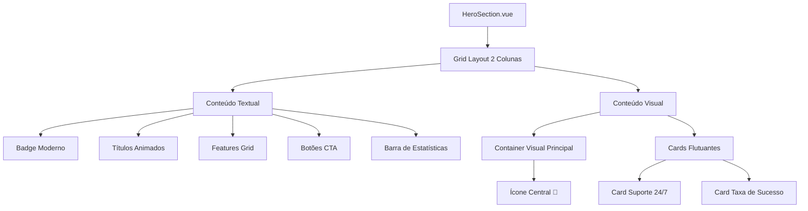
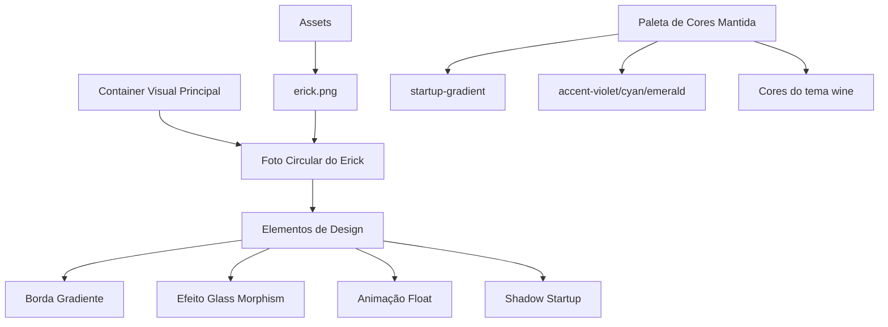
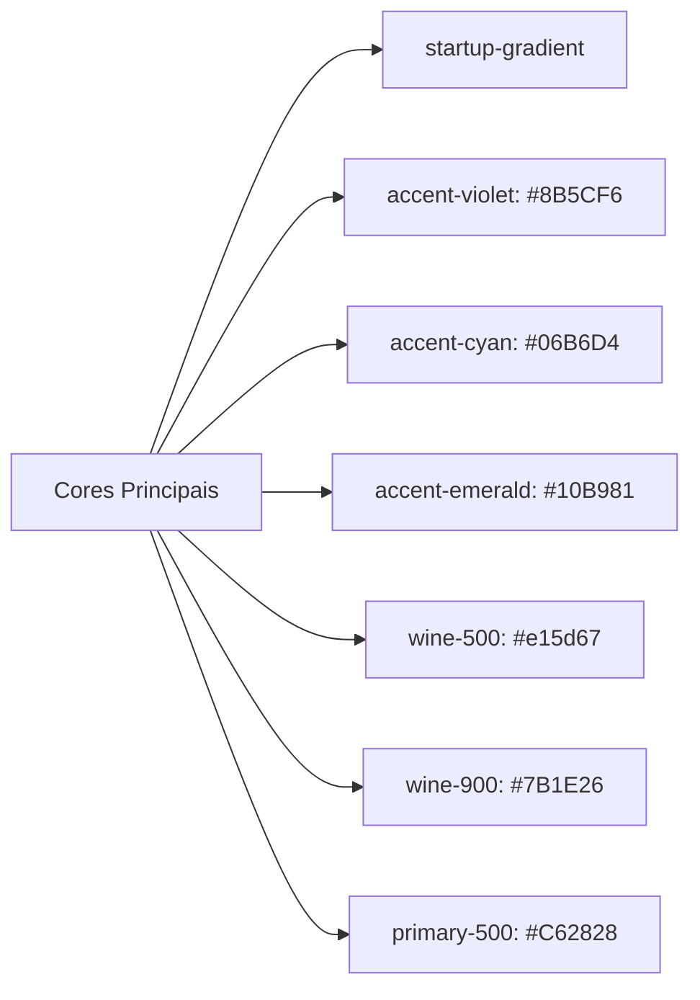
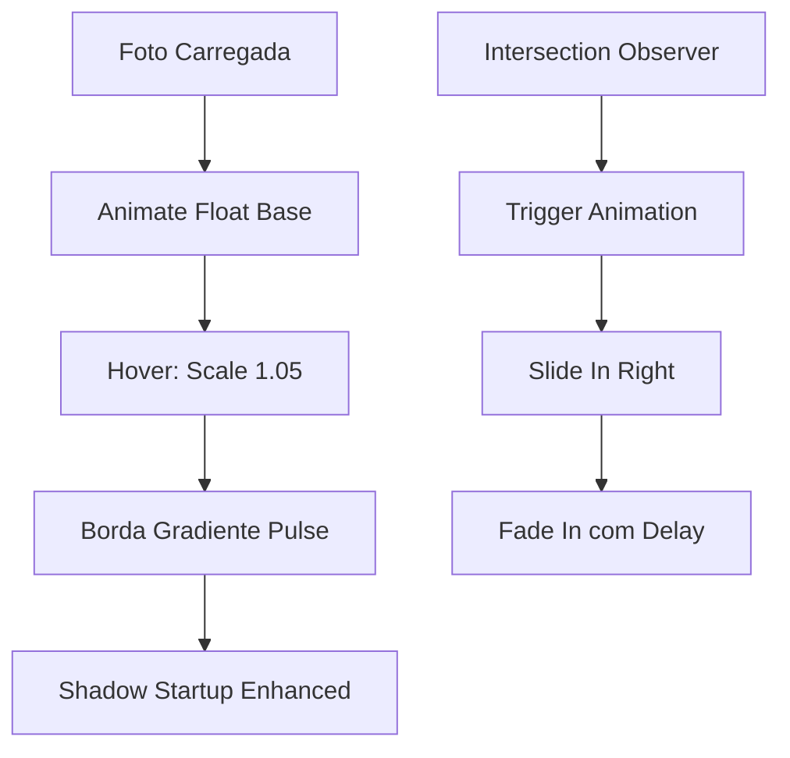
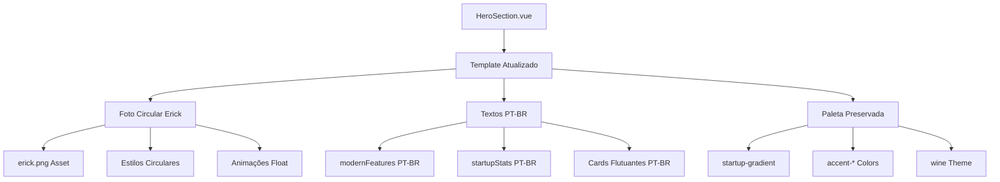

# Implementação de Foto do Erick na Hero Section - Projeto Quartzo Engineering

## Visão Geral

Este documento detalha a implementação da foto do Erick em formato circular na seção Hero do site Quartzo Engineering, mantendo a paleta de cores existente e o idioma português brasileiro em todas as seções.

## Arquitetura do Sistema

### Identificação do Tipo de Repositório
O projeto Quartzo Engineering é uma **Aplicação Frontend** construída com Vue.js 3, utilizando:
- Vue.js 3 com Composition API
- Vite como ferramenta de build
- Tailwind CSS para estilização
- Pinia para gerenciamento de estado
- Estrutura de componentes modular

### Stack Tecnológica
- **Frontend**: Vue.js 3.3+, Vue Router 4.2+, Pinia 2.1+
- **Build Tool**: Vite 4.3+
- **Estilização**: Tailwind CSS 3.3+ com tema personalizado
- **Processamento CSS**: PostCSS 8.4+, Autoprefixer 10.4+

## Arquitetura de Componentes

### Hero Section - Estrutura Atual



### Modificações Propostas para Foto do Erick



## Implementação da Foto Circular

### 1. Estrutura de Arquivo de Imagem
- **Localização**: `src/assets/images/erick.png` (já existe)
- **Tamanho**: 866.4KB
- **Formato**: PNG com transparência

### 2. Componente de Foto Circular

```vue
<!-- Substituição do ícone central no Container Visual -->
<div class="aspect-w-4 aspect-h-5 relative">
  <div class="absolute inset-0 bg-gradient-to-br from-white/20 to-white/5 rounded-3xl backdrop-blur-lg border border-white/20 shadow-startup overflow-hidden">
    <!-- Foto do Erick - Substituindo o ícone 🚀 -->
    <div class="relative z-10 flex items-center justify-center h-full">
      <div class="photo-container">
        <div class="photo-frame">
          
        </div>
        <!-- Elementos decorativos mantidos -->
        <div class="photo-decoration">
          <div class="text-center space-y-2 mt-6">
            <div class="text-2xl font-bold text-white">Erick Silva</div>
            <div class="text-lg text-white/80">Engenheiro Civil</div>
          </div>
        </div>
      </div>
    </div>
  </div>
</div>
```

### 3. Estilos CSS para Foto Circular

```css
.photo-container {
  @apply text-center space-y-6 p-8;
}

.photo-frame {
  @apply relative inline-block;
}

.photo-frame::before {
  content: '';
  @apply absolute -inset-2 bg-gradient-to-r from-accent-violet via-accent-emerald to-accent-cyan rounded-full animate-pulse;
  z-index: -1;
}

.photo-image {
  @apply w-32 h-32 md:w-40 md:h-40 lg:w-48 lg:h-48 rounded-full object-cover;
  @apply border-4 border-white/20 shadow-startup;
  @apply transition-all duration-500 hover:scale-105;
  filter: brightness(1.1) contrast(1.1);
}

.photo-decoration {
  @apply relative z-10;
}
```

## Manutenção da Paleta de Cores

### Paleta Existente Preservada



### Aplicação na Foto do Erick
- **Borda Gradiente**: Utiliza `from-accent-violet via-accent-emerald to-accent-cyan`
- **Background**: Mantém o `startup-gradient` existente
- **Elementos Decorativos**: Preservam as cores `accent-*` existentes
- **Texto**: Mantém `text-white` e `text-white/80` para consistência

## Estrutura de Idioma - Português Brasil

### Seções Identificadas para Manutenção em PT-BR

1. **Hero Section**
   - Badge: "Next-Generation Engineering Solutions" → "Soluções de Engenharia de Nova Geração"
   - Título: "Engineering the Future Today" → "Engenharia do Futuro Hoje"
   - Subtítulo mantido em português

2. **Features Modernos**
   ```javascript
   modernFeatures: [
     'Design Assistido por IA',
     'Colaboração Digital', 
     'Monitoramento em Tempo Real',
     'Soluções Sustentáveis'
   ]
   ```

3. **Estatísticas**
   ```javascript
   startupStats: [
     { value: '50+', label: 'Projetos Entregues', icon: '🚀' },
     { value: '98%', label: 'Satisfação do Cliente', icon: '⭐' },
     { value: '24/7', label: 'Suporte Disponível', icon: '💬' }
   ]
   ```

4. **Botões de Ação**
   - "Get Started" → "Começar Agora"
   - "View Projects" → "Ver Projetos"

### Cards Flutuantes - Tradução

```javascript
floatingCards: [
  {
    icon: '⚡',
    title: 'Suporte 24/7',
    subtitle: 'Sempre Disponível'
  },
  {
    icon: '🎯', 
    title: 'Taxa de Sucesso 98%',
    subtitle: 'Resultados Comprovados'
  },
  {
    icon: '🏆',
    title: 'Premiado',
    subtitle: 'Reconhecimento'
  },
  {
    icon: '🌱',
    title: 'Sustentável',
    subtitle: 'Eco-Friendly'
  }
]
```

## Animações e Interações

### Animações da Foto do Erick



### Micro-interações Implementadas
- **Float Animation**: Movimento suave vertical contínuo
- **Hover Scale**: Aumento sutil (1.05x) no hover
- **Gradient Border**: Animação pulse na borda gradiente
- **Responsividade**: Tamanhos adaptativos (w-32 → w-48)

## Considerações de Performance

### Otimização de Imagem
- Imagem `erick.png` (866.4KB) pode ser otimizada
- Considerar formato WebP para melhor compressão
- Implementar lazy loading se necessário

### CSS Scoped
- Estilos específicos encapsulados no componente
- Utilização de classes Tailwind para consistência
- Animações otimizadas com `transform` e `opacity`

## Estrutura de Testes

### Cenários de Teste Recomendados
1. **Responsividade**: Verificar em diferentes breakpoints
2. **Carregamento**: Teste de fallback se imagem falhar
3. **Acessibilidade**: Alt text e navegação por teclado
4. **Performance**: Tempo de carregamento da imagem
5. **Animações**: Funcionamento em dispositivos com motion reduzido

### Validação de Idioma
- Verificar todos os textos em português brasileiro
- Validar acentuação e gramática
- Testar responsividade do texto em diferentes tamanhos

## Arquitetura Final

