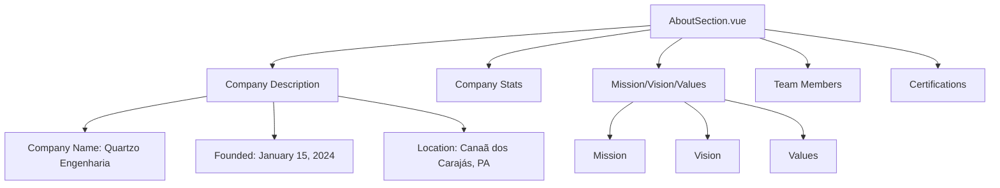
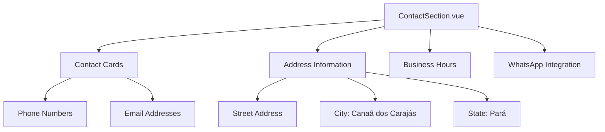
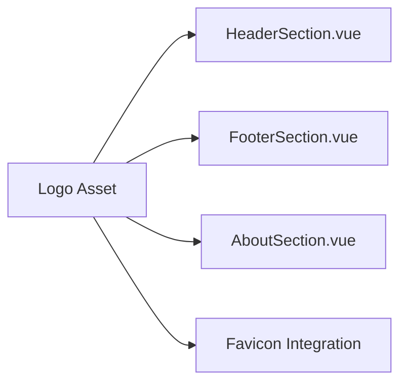

# Company Information Update Design

## Overview
This design document outlines the update of company information throughout the website to reflect the accurate details of Erick Antonio's engineering company located in Canaã dos Carajás, Pará. The updates will replace the current placeholder information with the real company data, including mission, vision, values, history, and contact details.

## Technology Stack & Dependencies
- **Vue.js 3**: Frontend framework with Composition API
- **Pinia**: State management for dynamic content
- **Tailwind CSS**: Styling framework
- **Vite**: Build tool and development server

## Component Architecture

### Components Requiring Updates

#### AboutSection.vue
The main component containing company information that needs comprehensive updates:



#### ContactSection.vue
Contact information component requiring location and contact details updates:



### Data Model Updates

#### Company Information Structure
```javascript
// Updated company data structure
companyInfo: {
  name: "Quartzo Engenharia",
  founder: "Erick Antonio",
  foundedDate: "January 15, 2024",
  location: {
    city: "Canaã dos Carajás",
    state: "Pará",
    region: "Norte"
  },
  founderEducation: {
    degree: "Civil Engineering",
    graduationYear: 2021,
    state: "Tocantins"
  }
}
```

#### Mission, Vision, and Values Content
```javascript
companyPillars: [
  {
    icon: '🎯',
    title: 'Missão',
    description: 'Oferecer soluções em engenharia civil com excelência técnica, transparência e comprometimento, atuando na construção, consultoria e elaboração de orçamentos com foco na qualidade, segurança e plena satisfação dos clientes.'
  },
  {
    icon: '👁️',
    title: 'Visão', 
    description: 'Ser referência regional em engenharia civil e consultoria técnica, reconhecida pela confiabilidade, inovação e impacto positivo nas obras que realizamos e nos projetos que orientamos.'
  },
  {
    icon: '💎',
    title: 'Valores',
    description: 'Ética e transparência, comprometimento com o cliente, qualidade técnica, inovação e melhoria contínua, sustentabilidade, colaboração e respeito.'
  }
]
```

## Content Updates Specification

### AboutSection Component Updates

#### Company Description
Replace the existing company description with the authentic history of Erick Antonio's company:

- **Foundation Date**: January 15, 2024
- **Location**: Canaã dos Carajás, Pará
- **Founder**: Erick Antonio (Civil Engineer, graduated 2021 in Tocantins)
- **Previous Experience**: Work on schools, CRAS units, and other public works
- **Current Projects**: Municipal Housing Secretary works, commercial warehouses, residential projects

#### Company Statistics
Update statistics to reflect actual company performance:

```javascript
companyStats: [
  { value: '1+', label: 'Ano de Atuação' },
  { value: '15+', label: 'Projetos Entregues' },
  { value: '100%', label: 'Aprovação Técnica' }
]
```

#### Team Section
Update team information to reflect Erick Antonio as the principal engineer:

```javascript
teamMembers: [
  {
    name: 'Erick Antonio',
    role: 'Engenheiro Civil - Fundador',
    description: 'Especialista em obras públicas e residenciais, graduado em 2021 no Tocantins',
    avatar: '👨‍💼'
  }
]
```

### ContactSection Component Updates

#### Address Information
Update location details to Canaã dos Carajás:

```javascript
address: {
  street: "Endereço a ser definido",
  neighborhood: "Centro", 
  city: "Canaã dos Carajás",
  state: "Pará",
  zipCode: "68537-000"
}
```

#### Contact Methods
- Update phone numbers for Pará region
- Update email domains to reflect company branding
- Adjust WhatsApp integration for local area code

### Logo Integration

#### Asset Management
- **File Location**: `src/assets/images/quartzo-logo.png`
- **Usage**: Replace placeholder logos throughout the application
- **Components**: HeaderSection, FooterSection, AboutSection



## Implementation Strategy

### Phase 1: Core Information Updates
1. Update AboutSection.vue with authentic company information
2. Replace mission, vision, and values content
3. Update founder and team information
4. Integrate company logo asset

### Phase 2: Contact Information Updates  
1. Update ContactSection.vue with Canaã dos Carajás location
2. Adjust contact phone numbers and email addresses
3. Update map integration for correct geographical location
4. Modify WhatsApp integration for regional area code

### Phase 3: Consistency Checks
1. Ensure all components reflect updated information
2. Verify logo integration across all sections
3. Test contact form functionality
4. Validate geographical references

## Business Logic Updates

### Contact Form Integration
Update form submission to reflect new company contact preferences:

```javascript
// Update default contact form data
contactForm: {
  name: '',
  email: '',
  phone: '',
  service: '',
  message: '',
  location: 'Canaã dos Carajás, PA' // Default location
}
```

### Services Alignment
Ensure services listed align with company expertise:
- Construction services
- Technical consulting  
- Budget preparation
- Municipal Housing Program participation
- Commercial and residential projects

## Testing Strategy

### Content Validation
- Verify all text content matches provided company information
- Ensure proper Portuguese language formatting
- Validate mission, vision, and values accuracy

### UI/UX Testing
- Test logo display across different screen sizes
- Verify contact information accessibility
- Validate map integration for Canaã dos Carajás location

### Functional Testing
- Test contact form submission with new company details
- Verify WhatsApp integration with updated phone numbers
- Validate email links with new company domains

## Visual Design Considerations

### Logo Implementation
- Maintain existing color scheme compatibility
- Ensure logo scales properly across components
- Implement proper alt text for accessibility

### Geographic Context
- Update any regional references to reflect Pará state context
- Ensure cultural appropriateness for northern Brazil region
- Adapt business hours to local timezone considerations

## Content Migration Checklist

### AboutSection Updates
- [ ] Company name and founder information
- [ ] Foundation date (January 15, 2024)
- [ ] Location (Canaã dos Carajás, Pará)
- [ ] Mission statement
- [ ] Vision statement  
- [ ] Values enumeration
- [ ] Company history narrative
- [ ] Team member information
- [ ] Statistics adjustment

### ContactSection Updates
- [ ] Address information
- [ ] Phone numbers (Pará area codes)
- [ ] Email addresses
- [ ] WhatsApp integration
- [ ] Map location reference
- [ ] Business hours localization

### Asset Integration
- [ ] Logo file placement
- [ ] Header logo implementation
- [ ] Footer logo implementation
- [ ] Favicon update
- [ ] Social media integration